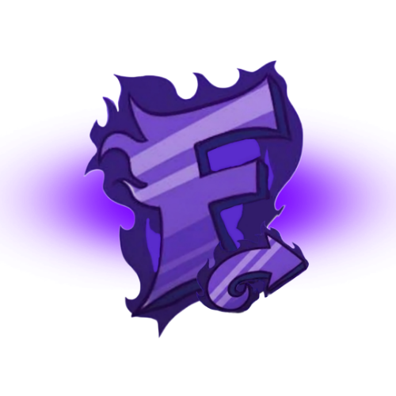
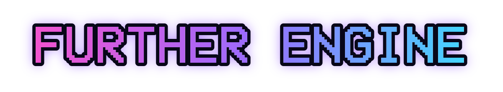
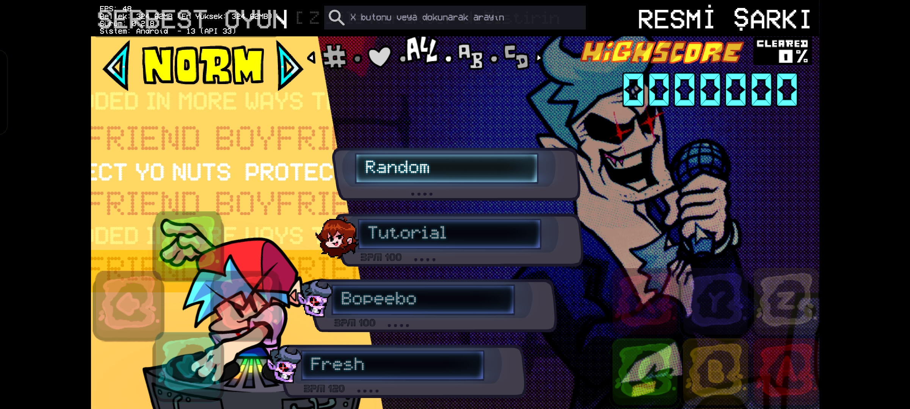
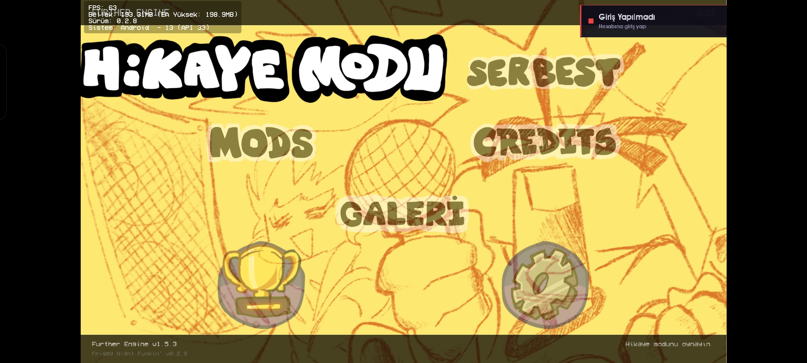
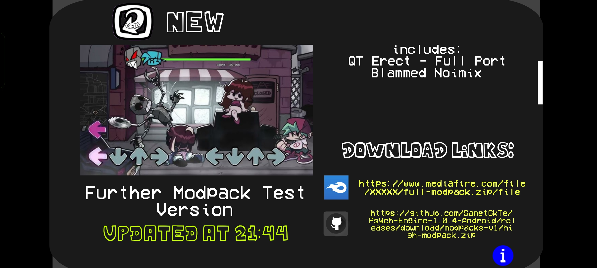

 

**Further Engine, FNF Kullanıcıların Oyun deneyimini en iyi hale getirmeyi amaçlar diğer adı ile "Psych Engine Türkiye" olarak bilinir**

> [!ÖNEMLİ]
> Proje yapılma aşamasındadır. Özellikle mobil desteği, çevrimiçi sunucular ve yeni arayüzlerde platforma bağlı sorunlarla karşılaşılabilir. Bir hata alırsan kullandığın platformu ve mümkünse crash logunu (pc: oyun/logs/ensonaldığınlog, mobilde: KULLANDIĞIN DEPOLAMA TÜRÜ/logs/ensonaldığınlog) ekleyerek [issue açabilirsin](https://github.com/SametGkTe/Funky-Further-Engine/issues/new/choose).

> [!NOT]
> Further Engine SametGkTe tarafından yapılan bağımsız bir topluluk projesidir; The Funkin' Crew veya resmi Friday Night Funkin' ekibiyle bağlantılı değildir.

[**Derleme rehberi**](docs/BUILDING_TR.md) · [**Modlama rehberi**](docs/MODDING_TR.md) · [**Hata bildir**](https://github.com/SametGkTe/Funky-Further-Engine/issues/new/choose)

### Arayüzler

Klasik Psych Engine görünümü ile yeni V-Slice  menü stili arasında geçiş yap. Ana menü, Story Mode, Freeplay gibi menülerde etkili olur. Fakat cihazınızda donma / kasma problemleri oluşabilir

</td>
<td width="50%" valign="top">

### Modpackler
**YAKINDA**

Further için onaylanmış Modpackleri oyun içinden indir, içe aktar, güncelle veya kaldır. GitHub ve MediaFire kaynakları (Beta)

</td>
</tr>
<tr>
<td width="50%" valign="top">

### Mobil Desteği

Android için **Psych Hitbox** ve **V-Slice Kontrolü**, mobil kontrol opaklığı, hitbox görünümü, ve farklı depolama ayarları.

</td>
<td width="50%" valign="top">

### Further Mod Desteği

**Galeri Sistemi**; Resim, Spritesheet, video, müzik ve ses efektlerini galeriye koy. Mod yapımcıları kendi `gallery.json` içeriğini ekleyebilir. (mod/other/gallery.json)

</td>
</tr>
</table>

## Yapımcılar

### Further Engine

- **[SametGkTe](https://github.com/SametGkTe)** — Further Engine Ana Geliştiricisi

### Temel projeler ve ekipler

- **[Shadow Mario](https://github.com/ShadowMario)** — Psych Engine ana geliştiricisi
- **RiverOaken / Riveren** — Psych Engine ana sanatçısı ve animatörü
- **[Psych Engine](https://github.com/ShadowMario/FNF-PsychEngine)** katkıcıları
- **[Psych Engine Mobile](https://github.com/Luansilv16/Psych-Engine-1.0.4-Android)** port ekibi ve katkıcıları
- **[The Funkin' Crew](https://github.com/FunkinCrew)** — Friday Night Funkin'

**Kullandığın FNF'i daha fazla ileri (Further) it.**

